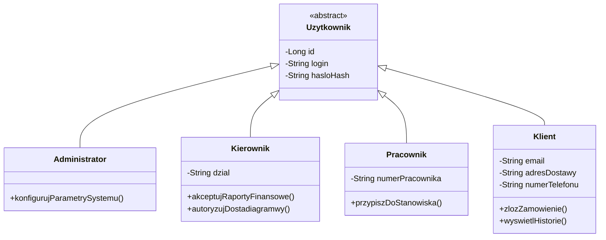
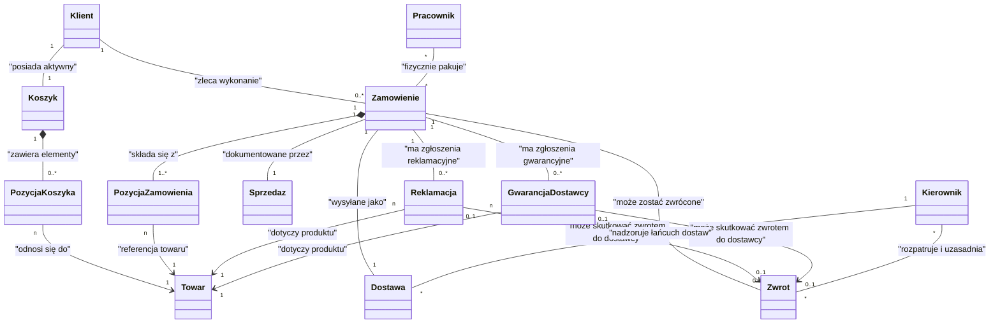

# Diagram klas – podział na strefy

**Pełny diagram (jeden plik, kopiuj do Mermaid Live Editor):** sklep-pelny.md lub Sklep.txt.

Poniżej model w **5 mniejszych diagramach** – skopiuj zawartość każdego bloku Mermaid osobno do edytora, żeby zachować czytelność połączeń.

## Sekcja 1 – Role i osoby (aktorzy)

## Sekcja 2 – Serwisy i interfejsy

```mermaid
classDiagram

    %% --- STREFA: SERWISY I INTERFEJSY ---

    class Autentykacja {

        <<interface>>

        +zaloguj(login, haslo)

        +wyloguj()

        +resetujHaslo(email)

    }

    class ZarzadzanieKontami {

        <<interface>>

        +stworzNoweKonto(Uzytkownik u)

        +modyfikujUprawnienia(id, nowaRola)

        +zablokujDostep(id, powod)

        +usunKonto(id)

    }

    class ZarzadzaniePersonelem {

        <<interface>>

        +zatrudnijPracownika(Pracownik p)

        +zmienUprawnieniaPracownika(id)

        +edytujDanePracownika(Pracownik p)

    }

    class MagazynPubliczny {

        <<interface>>

        +sprawdzDostepnosc(idTowaru)

        +pobierzCene(idTowaru)

        +pobierzOpis(idTowaru)

    }

    class MagazynPelny {

        <<interface>>

        +pobierzPelnyStanMagazynu(idTowaru)

        +zarezerwujTowar(idTowaru, ilosc)

        +aktualizujStanPoDostawie(idTowaru, ilosc)

        +oznaczTowarJakoUszkodzony(idTowaru)

    }

    MagazynPelny --|> MagazynPubliczny

    class ObslugaDostawPracownik {

        <<interface>>

        +zatwierdzOdbiorDostawy(idDostawy)

        +zglosUwagiDoDostawy(idDostawy, opis)

        +sprawdzStatusDostawy(idDostawy)

    }

    class ZarzadzanieLogistykaKierownik {

        <<interface>>

        +zamowDostaweUProducenta(listaTowarow)

        +anulujDostawe(idDostawy)

        +generujRaportLogistyczny()

    }

    ZarzadzanieLogistykaKierownik --|> ObslugaDostawPracownik

    class ProcesZamowieniaKlient {

        <<interface>>

        +utworzZamowienie(Klient k, Koszyk koszyk)

        +obliczKoszt(adres)

        +potwierdzPlatnosc(idZamowienia)

        +anulujZanimWyslane(idZamowienia)

    }

    class ProcesowanieZamowien {

        <<interface>>

        +zatwierdzDoWysylki(idZam)

        +pobierzStatystykiSprzedazy()

        +wymusZmianeStatusu(idZam, status)

    }

    class ZwrotKlient {

        <<interface>>

        +zglosZwrot(idZamowienia, listaPozycji, powod)

        +sprawdzStatusZwrotu(idZwrotu)

    }

    class ZwrotObslugaPracownik {

        <<interface>>

        +weryfikujStanTowaru(idZwrotu, opisStanu)

        +potwierdzOdbiorPaczki(idZwrotu)

        +dodajZdjeciaWeryfikacyjne(idZwrotu, linki)

    }

    class ZwrotDecyzjaKierownik {

        <<interface>>

        +akceptujZwrot(idZwrotu)

        +odrzucZwrot(idZwrotu, uzasadnienie)

        +zlećZwrotSrodkow(idZwrotu)

    }

    ZwrotDecyzjaKierownik --|> ZwrotObslugaPracownik

    class ReklamacjaKlient {
        <<interface>>
        +zglosReklamacje(idZamowienia, listaPozycji, powod, opis)
        +sprawdzStatusReklamacji(idReklamacji)
    }

    class ReklamacjaObslugaPracownik {
        <<interface>>
        +weryfikujStanTowaruReklamowanego(idReklamacji, opisStanu)
        +dodajZdjeciaWeryfikacyjne(idReklamacji, linki)
    }

    class ReklamacjaDecyzjaKierownik {
        <<interface>>
        +akceptujReklamacje(idReklamacji)
        +odrzucReklamacje(idReklamacji, uzasadnienie)
        +zlećZwrotDoDostawcy(idReklamacji)
    }

    ReklamacjaDecyzjaKierownik --|> ReklamacjaObslugaPracownik
```

## Sekcja 3 – Encje danych

```mermaid
classDiagram

    %% --- STREFA: ENCJE DANYCH ---

    class Towar {

        -Long id

        -String nazwa

        -BigDecimal cena

        -int stanMagazynowy

        -String kategoria

    }

    class Koszyk {

        -BigDecimal sumaCzesciowa

        +dodaj(Towar t, ilosc)

        +usun(Towar t)

        +obliczSume()

    }

    class PozycjaKoszyka {

        -int ilosc

        -BigDecimal cenaWChwiliDodania

    }

    class Zamowienie {

        -Long id

        -Date dataZlozenia

        -String statusZamowienia

        -String metodaPlatnosci

    }

    class PozycjaZamowienia {

        -int ilosc

        -BigDecimal cenaSnapshot

        -BigDecimal podatek

    }

    class Sprzedaz {

        -String nrFaktury

        -BigDecimal kwotaBrutto

        -BigDecimal kwotaNetto

        -Date dataWystawienia

    }

    class Dostawa {

        -String nrKuriera

        -String statusPrzesylki

        -String dostawca

        -Date data dataWystawienia

        -Date dataDostarczenia

        -Date przewidywanaData

    }

    class Zwrot {

        -String uzasadnienie

        -String statusDecyzji

        -Date dataZgloszenia

        -Date data decyzji

        -String komentarzKierownika

    }

    class ZgloszenieProduktowe {
        <<abstract>>
        -Long id
        -Date dataZgloszenia
        -String status
        -String powod
    }

    class Reklamacja {
        -String opisUsterki
        -Date dataDecyzji
        -String uzasadnienieKierownika
    }

    class GwarancjaDostawcy {
        -String wymaganyTryb
        -Date dataDecyzji
        -String uzasadnienieKierownika
    }

    Reklamacja --|> ZgloszenieProduktowe
    GwarancjaDostawcy --|> ZgloszenieProduktowe
```

## Sekcja 4 – Relacje dostępu (kto używa czego)

```mermaid
classDiagram

    %% --- STREFA: RELACJE DOSTĘPU (kto używa czego) ---
    %% Skrócone klasy – szczegóły w strefach 1–2.

    class Uzytkownik
    class Administrator
    class Kierownik
    class Pracownik
    class Klient

    class Autentykacja
    class ZarzadzanieKontami
    class ZarzadzaniePersonelem
    class ZarzadzanieLogistykaKierownik
    class MagazynPelny
    class MagazynPubliczny
    class ProcesowanieZamowien
    class ObslugaDostawPracownik
    class ZwrotObslugaPracownik
    class ZwrotDecyzjaKierownik
    class ProcesZamowieniaKlient
    class ZwrotKlient
    class ReklamacjaKlient
    class ReklamacjaObslugaPracownik
    class ReklamacjaDecyzjaKierownik

    Uzytkownik --> Autentykacja

    Administrator --> ZarzadzanieKontami
    Administrator --> ZarzadzanieLogistykaKierownik

    Kierownik --> ZarzadzaniePersonelem
    Kierownik --> ZarzadzanieLogistykaKierownik
    Kierownik --> ZwrotDecyzjaKierownik
    Kierownik --> ReklamacjaDecyzjaKierownik

    Pracownik --> ProcesowanieZamowien
    Pracownik --> ObslugaDostawPracownik
    Pracownik --> ZwrotObslugaPracownik
    Pracownik --> ReklamacjaObslugaPracownik
    Pracownik ..> MagazynPelny

    Klient --> ProcesZamowieniaKlient
    Klient --> ZwrotKlient
    Klient --> ReklamacjaKlient
    Klient ..> MagazynPubliczny
```

## Sekcja 5 – Relacje strukturalne

